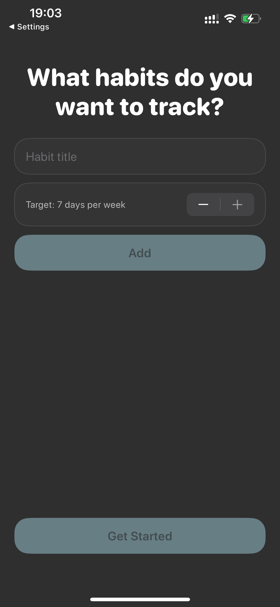
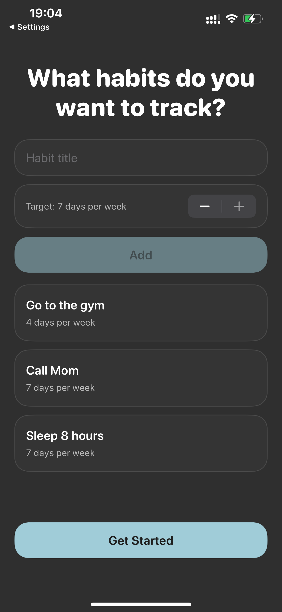
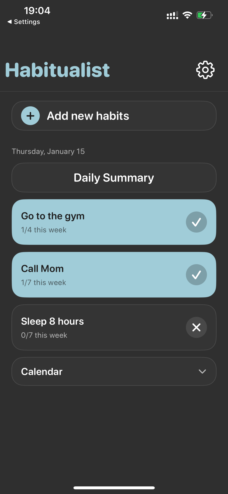

# Habitualist

A modern, privacy-focused habit tracking application for iPhone. Built with SwiftUI and SwiftData, Habitualist helps you build better habits through daily tracking, weekly goal setting, and comprehensive progress visualization.


## Features

### Core Functionality
- **Habit Management**: Create, edit, and archive habits with custom titles
- **Daily Tracking**: Mark habits as complete with a simple tap
- **Weekly Targets**: Set custom weekly goals (1-7 days) for each habit
- **Progress Tracking**: Visual progress indicators showing weekly completion status
- **Smart Completion States**: Habits turn blue when completed today or weekly target is met

### Calendar & History
- **In-App Calendar**: Browse past days through an interactive month calendar
- **Historical Summaries**: View detailed daily summaries for any date
- **Completion Indicators**: Visual dots and blue highlights show completed days
- **Week-Based Progress**: Weekly progress calculated relative to any selected date

### User Experience
- **Dark Theme Design**: Modern dark UI inspired by Dribbble design references
- **Card-Based Interface**: Beautiful rounded cards with subtle borders and smooth animations
- **Collapsible Calendar**: Expandable calendar section for easy navigation
- **Onboarding Flow**: Intuitive setup process for new users
- **Settings**: Appearance preferences and optional Apple Calendar integration

### Data & Integration
- **Local-Only Storage**: All data stored locally using SwiftData (privacy-first)
- **Apple Calendar Integration**: Optional export of daily summaries to Apple Calendar
- **Timezone Aware**: Proper date handling using device timezone
- **Persistent History**: Complete habit completion history stored indefinitely

## Screenshots

<p align="center">
  
  
  
</p>
<p align="center">
  
  
</p>

## Tech Stack

- **Framework**: SwiftUI 5.0
- **Data Persistence**: SwiftData
- **Architecture**: MVVM-style with clean separation of concerns
- **Design Pattern**: Declarative UI with reactive data flow
- **Calendar Integration**: EventKit for Apple Calendar export
- **Minimum iOS**: 17.0+

## Architecture

### Project Structure

```
Habitualist/
├── HabitualistApp.swift          # App entry point with SwiftData setup
├── Theme/
│   └── Theme.swift               # Centralized theme system (colors, fonts, styles)
├── Models/
│   ├── Habit.swift               # SwiftData model for habits
│   └── Completion.swift          # SwiftData model for daily completions
├── Services/
│   ├── DayKeyService.swift       # Date key helper using device timezone
│   ├── WeeklyProgressService.swift # Weekly progress calculation logic
│   └── CalendarEventService.swift # Apple Calendar integration
└── Views/
    ├── RootView.swift            # Root navigation controller
    ├── OnboardingView.swift      # First-time user setup
    ├── TodayView.swift           # Main screen with habit list
    ├── MonthCalendarView.swift   # Calendar grid for browsing history
    ├── DailySummaryView.swift    # Today's summary view
    ├── DailySummaryByDateView.swift # Historical date summary view
    ├── AddHabitView.swift        # Form to add new habits
    ├── EditHabitView.swift       # Form to edit/archive habits
    └── SettingsView.swift        # App settings and preferences
```

### Key Design Decisions

- **SwiftData over Core Data**: Leverages modern Swift concurrency and declarative APIs
- **Local-Only Storage**: Privacy-focused, no cloud sync requirements
- **Theme System**: Centralized design tokens for consistent styling
- **Date Key System**: String-based date keys (YYYY-MM-DD) for efficient querying
- **ISO Calendar**: Monday-start weeks for consistent weekly calculations
- **Card-Based UI**: Modern, accessible interface with clear visual hierarchy

## Requirements

- iOS 17.0 or later
- Xcode 15.0 or later
- iPhone device or simulator

## Getting Started

### Prerequisites

- macOS 14.0 or later
- Xcode 15.0 or later
- iOS 17.0+ device or simulator

### Installation

1. **Clone the repository:**
   ```bash
   git clone https://github.com/DimePrangija/Habitualist.git
   cd Habitualist
   ```

2. **Open the project:**
   - Open `Habitualist.xcodeproj` in Xcode 15.0 or later
   - The Xcode project file is located at the repository root

3. **Build and run:**
   - Select your target device or simulator (iPhone recommended)
   - Build and run the project (⌘R)

### First Launch

On first launch, the app will guide you through the onboarding process:
- Create your first habits with custom titles
- Set weekly targets (1-7 days per week)
- Begin tracking your daily progress immediately

All source code is located in the `Habitualist/` subfolder following standard Xcode project structure.

## Usage Guide

### Creating and Managing Habits

1. **Add a new habit:**
   - Tap the "Add new habits" button on the main screen
   - Enter a descriptive habit title
   - Set your weekly target (1-7 days per week)
   - Tap "Save" to create the habit

2. **Edit or archive habits:**
   - Swipe left on any habit card to reveal the edit option
   - Modify the title, adjust weekly targets, or archive habits
   - Archived habits are hidden from the main view

### Tracking Daily Progress

- **Mark completion:** Tap anywhere on a habit card or the circular toggle button to mark it complete for today
- **Visual feedback:** Completed habits display with a blue background and checkmark icon
- **Progress updates:** Weekly progress counters update automatically as you complete habits

### Reviewing History

1. **Access calendar:**
   - Scroll to the bottom of the main screen
   - Tap "Calendar" to expand the interactive month view

2. **Navigate and explore:**
   - Use the left/right chevron buttons to navigate between months
   - Dates with completions show blue dot indicators
   - Dates with all habits completed display a blue background highlight

3. **View daily summaries:**
   - Tap any date to view its detailed summary
   - See completion status and weekly progress for that specific date
   - Historical data reflects the state at the time of that date

### Customization

- **Appearance:** Access settings via the gear icon to customize appearance preferences
- **Calendar integration:** Optionally export daily summaries to Apple Calendar for external tracking

## Development

### Architecture Overview

The application follows a clean, modular architecture:

- **Models**: SwiftData `@Model` classes handle data persistence and relationships
- **Services**: Business logic layer for date calculations, progress tracking, and calendar integration
- **Views**: SwiftUI views organized by feature with clear separation of concerns
- **Theme**: Centralized design system ensuring consistent styling across the application

### Code Standards

- Adheres to Swift API Design Guidelines
- Implements SwiftUI best practices (declarative, compositional patterns)
- Maintains strict separation between Models, Views, and Services
- Uses SwiftData for reactive, type-safe data management

### Contributing

1. Create a feature branch from `main`
2. Follow existing code patterns and architectural decisions
3. Ensure all changes build and run successfully
4. Update documentation for significant feature additions
5. Test thoroughly on physical devices and simulators

## Data Storage

All data is stored locally on the device using SwiftData:
- **Location**: Local SQLite database in app container
- **Persistence**: Permanent (until app deletion)
- **Privacy**: No cloud sync, no external servers
- **Capacity**: Effectively unlimited for normal usage

## Technical Details

### Data Persistence

Habitualist uses SwiftData for local data storage:
- **Storage Location**: Local SQLite database within the app container
- **Persistence Model**: All data persists permanently until app deletion
- **Privacy**: No cloud synchronization or external server communication
- **Capacity**: Effectively unlimited for typical usage patterns

### Performance Considerations

- Efficient date key system (YYYY-MM-DD format) enables fast queries
- Precomputed completion sets for calendar views minimize database queries
- Lazy loading patterns in calendar grid for optimal performance
- Timezone-aware date handling ensures accurate tracking across time zones

### Design System

The application implements a comprehensive design system:
- **Color Palette**: Dark theme (#2F2F2F background, #343434 cards, #A0CCD8 accent)
- **Typography**: System rounded fonts with consistent sizing hierarchy
- **Components**: Reusable card styles and standardized spacing
- **Accessibility**: High contrast ratios and semantic color usage

## License

This project is available for portfolio and resume demonstration purposes.

## Author

**Nikola Dimitrijevic**

---

Built with ❤️ using SwiftUI and SwiftData

